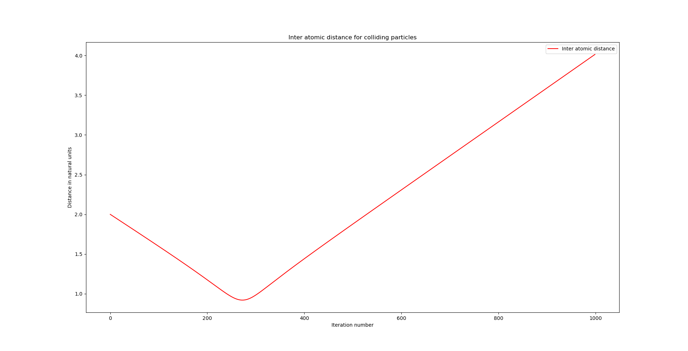
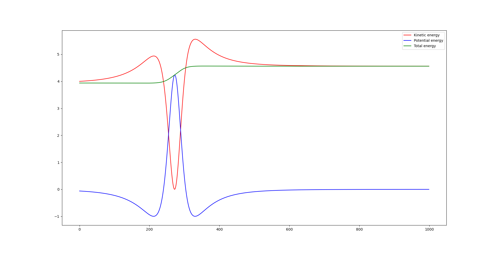
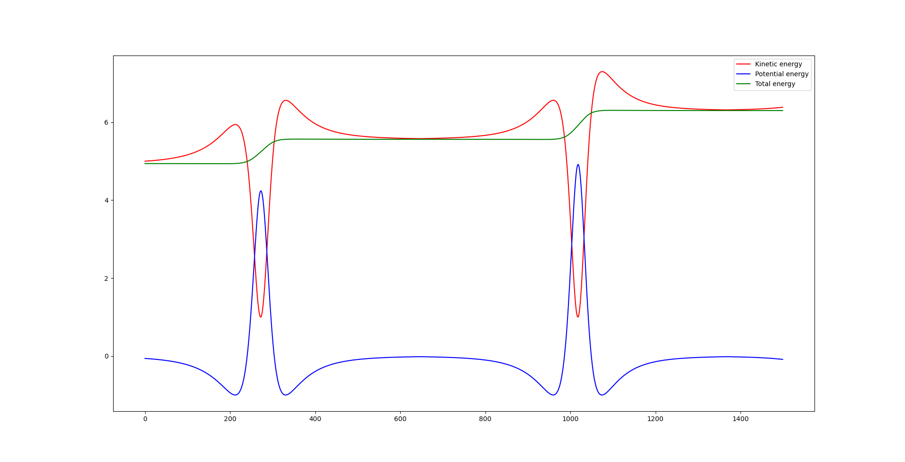
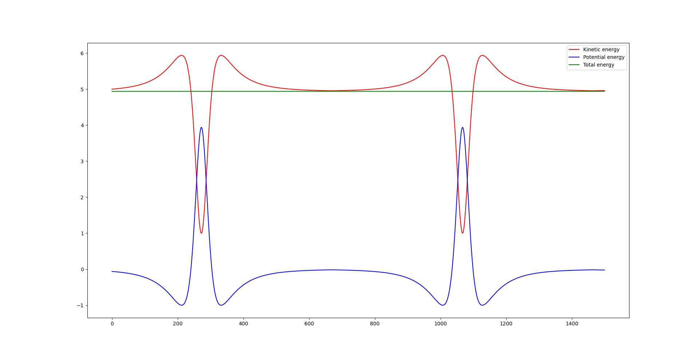
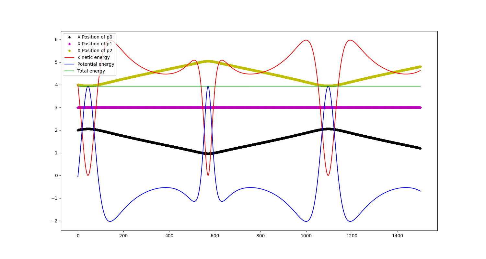
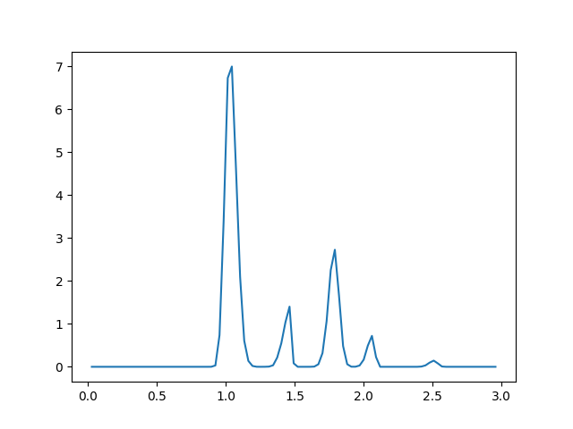
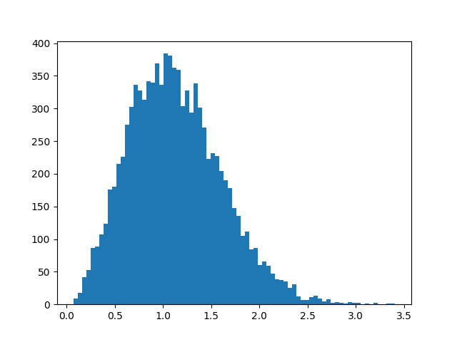
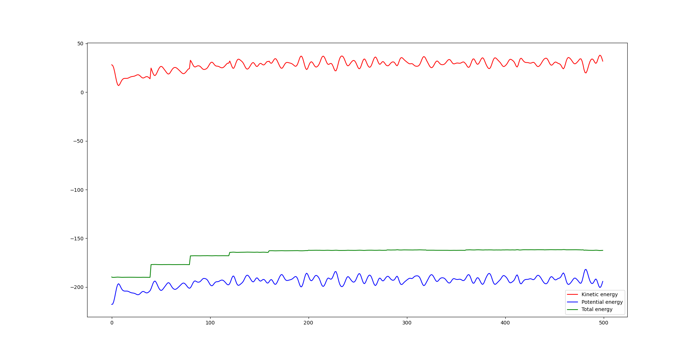
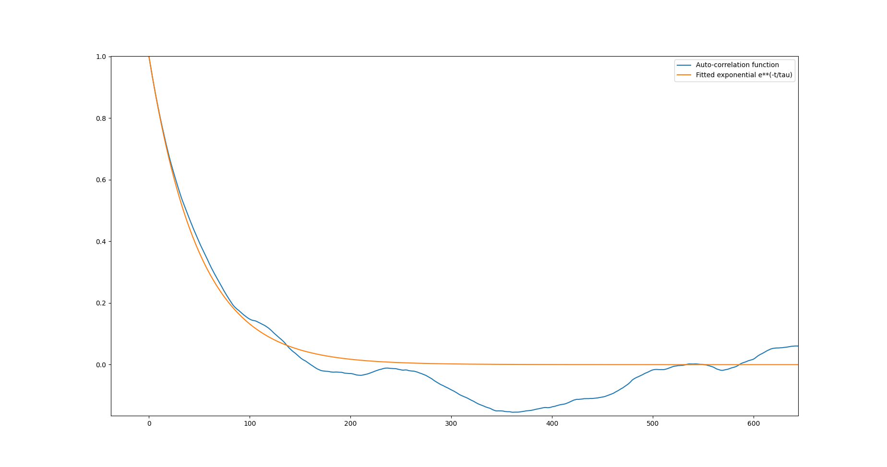

re# Weekly progress journal

## Instructions

In this journal you will document your progress of the project, making use of the weekly milestones.

Every week you should

1. write down **on the day of the lecture** a short plan (bullet list is sufficient) of how you want to
   reach the weekly milestones. Think about how to distribute work in the group,
   what pieces of code functionality need to be implemented.
2. write about your progress **until Sunday, 23:59** before the next lecture with respect to the milestones.
   Substantiate your progress with links to code, pictures or test results. Reflect on the
   relation to your original plan.

We will give feedback on your progress on Tuesday before the following lecture. Consult the
[grading scheme](https://computationalphysics.quantumtinkerer.tudelft.nl/proj1-moldyn-grading/)
for details how the journal enters your grade.

Note that the file format of the journal is *markdown*. This is a flexible and easy method of
converting text to HTML.
Documentation of the syntax of markdown can be found
[here](https://docs.gitlab.com/ee/user/markdown.html#gfm-extends-standard-markdown).
You will find how to include [links](https://docs.gitlab.com/ee/user/markdown.html#links) and
[images](https://docs.gitlab.com/ee/user/markdown.html#images) particularly
useful.

## Week 1
(due 14 February 2021, 23:59)

### Plan for the week
- Having studied Advanced Statistical Mechanics we are already familiar with the theoretical concepts of the first lecture. Therefore, our focus this week will be oriented towards getting confident using git as well as fulfilling the milestones of this week. To do this, we plan on doing the following:
- Start with implementing for 2 particles and check that the functions give expected results.
- First try and make it work without periodic boundary conditions and then incorporate periodic boundary conditions.
- Have initial random velocities from a particular distribution.

### Work done in the week.
The three of us (Smit Chaudhary, Yorgos Sotiropoulos, Ignacio Fernandez Grana) worked simultaneously using Visual Studio Code extension [LiveShare](https://visualstudio.microsoft.com/services/live-share/). So attributing any on  task to any one person is difficult.All of the milestones have been  met. If pressed to do so, one could argue that attributing 1/3rd work to each person would be the fairest way. Ignacio and Smit made commits at regular intervals but Yorgos has not received the invitation to the Gitlab server and so has been unable to commit this week.

- We did not yet implement the random initial velocity from a Gaussian but we plan to do that in later weeks.
- We discussed and implemented a convention for storing the positions and velocities of the particles. An explanation of this can be found in lines 79 and 80 of the skeleton and a small example for 2 particles in 2 dimensions can be found in the `sandbox.py` file.
- Instead of implementing for 2 particles, we implemented for an arbitrary number of particles.
- We also implemented for arbitrary number of dimensions and not necessarily just 2 dimensions.
- Tested all the functions in `sandbox.py`. The values of the physical quantities obtained using our code successfully matched the expected values from by-hand calculations.

## Week 2
(due 21 February 2021, 23:59)

### Plan for the week
- Modify previous implementation so that it keeps track of the position and velocity of each particle for all time steps.
- Update the simulation to do it in dimensionless units.
- Re-derive the expressions for Kinetic Energy, Potential Energy etc in dimensionless units.
- Since we already implemented for an arbitrary number of dimensions, simulating 2 atoms in 3D is straightforward now.

### Work done in the week.

Next we list all the contributions each of us made this week.

#### Yorgos: 
- Added functionality to store the positions and velocities for all particles at all time steps, as this was not fully done last week. [Line 41-64](https://gitlab.kwant-project.org/computational_physics/projects/Project-1_idonfernandezg/-/blob/master/skeleton.py#L41-64)
- Implemented the kinetic energy and the full simulation in natural units. [Line 180](https://gitlab.kwant-project.org/computational_physics/projects/Project-1_idonfernandezg/-/blob/master/skeleton.py#L180)
- Plotted the interatomic distance for a simulation of 2 particles in 3D, when two atoms are approaching one another. The behaviour is as expected, with the interatomic distance diminishing until the point of closest approach and then they move further apart. [Line 29-51 in sandbox](https://gitlab.kwant-project.org/computational_physics/projects/Project-1_idonfernandezg/-/blob/master/sandbox.py#L29-51)

#### Smit:
- Tested the simulation for 2 particles in 3 dimensions. Obtained realistic results in a marginal case. In particular, equal velocity while the relative position was in y direction gave no change in x and z components of velocity for either particle.[Lines 5-22 in sandbox](https://gitlab.kwant-project.org/computational_physics/projects/Project-1_idonfernandezg/-/blob/master/sandbox.py#L5-22)
- Tested the potential and Kinetic energies for simple values of positions and velocities (such as at the minima of the potential). [Lines 24-43 in sandbox](https://gitlab.kwant-project.org/computational_physics/projects/Project-1_idonfernandezg/-/blob/master/sandbox.py#L24-43)
- Tested the force function to check its value and direction is as intended.
- All functions seem to work as expected. We initially did make a mistake in writing the force function and the direction was not the same as expected. Was an error in sign in the function in `skeleton.py`.

#### Ignacio: 
- Tested the kinetic, potential, and total energy for two particles heading towards one another (colliding). As expected, can see the velocity going to zero at the point of closest approach. [Lines 5-22 in sandbox](https://gitlab.kwant-project.org/computational_physics/projects/Project-1_idonfernandezg/-/blob/master/sandbox.py#L29-51)
- What is unexpected is that the total energy does not remain constant over time, specially when the collision happens as both the kinetic and the potential energy largely fluctuate. This can be seen in the following picture.

+

We chalk that to the discrete euler method. It seems like this method does not work well in conditions where the kinetic and potential energy fluctuate rapidly. [Lines 50-64](https://gitlab.kwant-project.org/computational_physics/projects/Project-1_idonfernandezg/-/blob/master/skeleton.py#L50-64)

## Week 3
(due 28 February 2021, 23:59)

### Plan for the week
- First of all, and according to the issue made by Helene, we would like to improve the simulation of the collision of two particles we made last week, so that we can also check that the periodic boundary conditions work. This can be one either by running the simulation for a longer time or by making the box smaller.
- We have noticed that in our latest implementation the conservation of energy condition was not satisfied when the particles went under collisions. We attribute this to the Euler algorithm. We expect that by changing to Verlet algorithm will fix this major issue.
- Once the Verlet algorithm is implemented, we will check the conservation of energy in the same conditions as we did last week. 
- Since the code we already have from week 2 is designed to work for arbitrary number of particles, extending it to more than 2 particles is expected to be straight forward. We plan to check the implementation for mor than 2 particles.
- We have already been using the structure as in `skeleton.py` and since that seems to be a natural structure to follow, we plan to keep it the same.

#### Smit:
- Updated the simulation to run for longer time so that we can see the periodic boundary coniditions in action as given by another approaching collision after reflecting once.  We did this by reducing the dimensions of the box so that the particles had time to go through the boundary and meet again (see in `sandbox.py` [Line 22](https://gitlab.kwant-project.org/computational_physics/projects/Project-1_idonfernandezg/-/blob/master/sandbox.py#L22))
- We again see that the energy is not conserved each time there is a close approach and expect that to be better with the Verlet algorithm.
- The plot for KE, PE and Total Energy is as below.

#### Ignacio
- Implemented the Verlet's algorithm for both position and velocity (see in `skeleton.py` [Lines 65-70](https://gitlab.kwant-project.org/computational_physics/projects/Project-1_idonfernandezg/-/blob/master/skeleton.py#L65-70))
- Changed the signature of the simulate function so that it works with both Euler's and Verlet's method. (see `skeleton.py` [Lines 28-29](https://gitlab.kwant-project.org/computational_physics/projects/Project-1_idonfernandezg/-/blob/master/skeleton.py#28-29))

#### Yorgos
- Plotted the kinetic, potential and total energy with the Verlet's algorithm. We did this using the same conditions as we did with the Euler's algorithm, i.e., with two particles colliding once, bouncing back and then colliding again due to the periodic BC. With the Verlet's algorithm the total energy is conserved through the collisions, thus fixing the issue we observed last week with Euler's method. The plot can be found below.

- Simulated a 3 particle collision with the Verlet's algorithm to check that our code works for more than 2 particles. The plot showing both the energies and the positions of the particles can be found below. Note that the setup is like this (see `sandbox.py` [Lines 5-17](https://gitlab.kwant-project.org/computational_physics/projects/Project-1_idonfernandezg/-/blob/master/sandbox.py#L5-17)):
- - Two particles are headed towards each other in the direction of x.
- - One particle is stationary in the middle of these particles coming towards it from opposite positions. 
- - Thus, we expect that the middle particle will keep being stationary while the other two particles oscillate back and forth colliding either with each other or simultaneously with the stationary particle. Indeed, this is the picture we get in the figure.

## Week 4
(due 7 March 2021, 23:59)

### Plan for the week
- Based on the feedback we received last week, tweak our implementation so that we use numpy operations instead of for-loops, to make the code more efficient.
- Initialize the positions of the particles onto an fcc lattice.
- Initialise the velcoties to folllow a Maxwell-Boltzmann fistribution and check it continues ot folllow Maxwell-Boltzmann distribution.
- Implement rescalings until the system reaches the desired temperature.
- Study at least one observable in the system.

Next we list what each of us did this week. 

#### Ignacio
- Implemented the fcc lattice initialization of the positions. (see `skeleton.py` [Lines 216-240](https://gitlab.kwant-project.org/computational_physics/projects/Project-1_idonfernandezg/-/blob/master/skeleton.py#L216-240))
- We tried to change the for loops to numpy operations but did not succeed yet. We plan to work on it next week as well.
- Checked that for low temperatures, the particles merely jiggle and do not stray far from their initial positions but for high temperatures, the displacement was even greater than lattice constant.
- Implemented the pair-correlation function (see `skeleton.py` [Lines 103-120](https://gitlab.kwant-project.org/computational_physics/projects/Project-1_idonfernandezg/-/blob/master/skeleton.py#L103-120)). The result is presented in the following picture:

The first peak corresponds to the pairs of atoms such that one of them is in the corner of the unit cell and the other in the center of the face (\approx 1). The second one corresponds to the pairs of atoms separated by a distance equal to the lattice constant (\approx 1.5), and so on.

#### Smit
- Implemented the function to initialise the velocities from a Normal distribution (centered around zero and with a spread according to the temperature of the system. (see `skeleton.py` [Lines 317-337](https://gitlab.kwant-project.org/computational_physics/projects/Project-1_idonfernandezg/-/blob/master/skeleton.py#L317-337))
- Checked that velocity initialization follows a Maxwell-Boltzmann distribution. Below we see the histogram for 10000 particles. (see `sandbox.py` [Lines 43-52](https://gitlab.kwant-project.org/computational_physics/projects/Project-1_idonfernandezg/-/blob/master/sandbox.py#L43-52))

- The variable `temp` is the k*T in dimensionless units where k is the Boltzmann constant and T the temperature.

#### Yorgos
- Implemented the rescaling of the velocities so that the system attains the desired temperature. (see `skeleton.py` [Lines 75-82](https://gitlab.kwant-project.org/computational_physics/projects/Project-1_idonfernandezg/-/blob/master/skeleton.py#L75-82))

- Tested this implementation for `box_dim=2*lattice_const` which corresponds to 32 particles. Below the energy graph is presented:

## Week 5
(due 14 March 2021, 23:59)

### Plan for the week
- Change the code to store the simulation data generated and then do data processing separately so the simulation is not needed to be run everytime a new observable is being computed.
- Check memory and time requirements of the simulation and different parts of the code individually.
- Finish the change of for loops by numpy operations whenever is possible.
- Structure the code in a logical and clean way. For instance, add another file called `observables.py` where we store all the functions related to the measurement of the observables and its data processing.
- Incorporate error calculations for the observables.
- Reflect about which observables we want to study in the report.

#### Smit

- Implemented the autocorrelation function and the calculation of errors in the function auto_corr_func (see `observables.py` [Lines 8-63](https://gitlab.kwant-project.org/computational_physics/projects/Project-1_idonfernandezg/-/blob/master/observables.py#L8-63)).

#### Yorgos

- Tested the autocorrelation function with random data using the method provided in the lecture materials. Below we present the figure obtained with the curve fitting. Our random data are characterized by autocorrelation time \\( \tau=50 )\\. (see `sandbox.py` [Lines 64-66](https://gitlab.kwant-project.org/computational_physics/projects/Project-1_idonfernandezg/-/blob/master/sandbox.py#L64-66))

- Implemented an easy way to automatize the running of the simulation and storing the data (see `main.py` [Lines 30-53](https://gitlab.kwant-project.org/computational_physics/projects/Project-1_idonfernandezg/-/blob/master/main.py#L30-53)).

#### Ignacio

- Implemented the pressure observable in pressure function (see `observables.py` [Lines 65-110](https://gitlab.kwant-project.org/computational_physics/projects/Project-1_idonfernandezg/-/blob/master/observables.py#L65-110)). We run a simulation with 1000 timesteps and 32 particles with a temperature T=0.5 and computed the value and the error of the pressure, which turned out to be \\(P = 20.439 \pm 0.031)\\  (see `main.py` [Lines 62-65](https://gitlab.kwant-project.org/computational_physics/projects/Project-1_idonfernandezg/-/blob/master/main.py#L62-65))

### General remarks

- The efficiency of our code looks reasonable. A simulation for 32 particles for 20000 timesteps of 0.001 was completed in close to half an hour. Nevertheless, the efficiency of some operations can still be improved, as there are some for loops that still can be replaced for numpy operations.

- For the report, we plan to implement the rest of the obsevables next week. Verify certain properties of the systems we simulate, as for example simulate the conditions of a gas and plot a P-T diagram to check that it does not follow the ideal gas law. We also would like to study the behaviour of our system when it undergoes a phase transition.